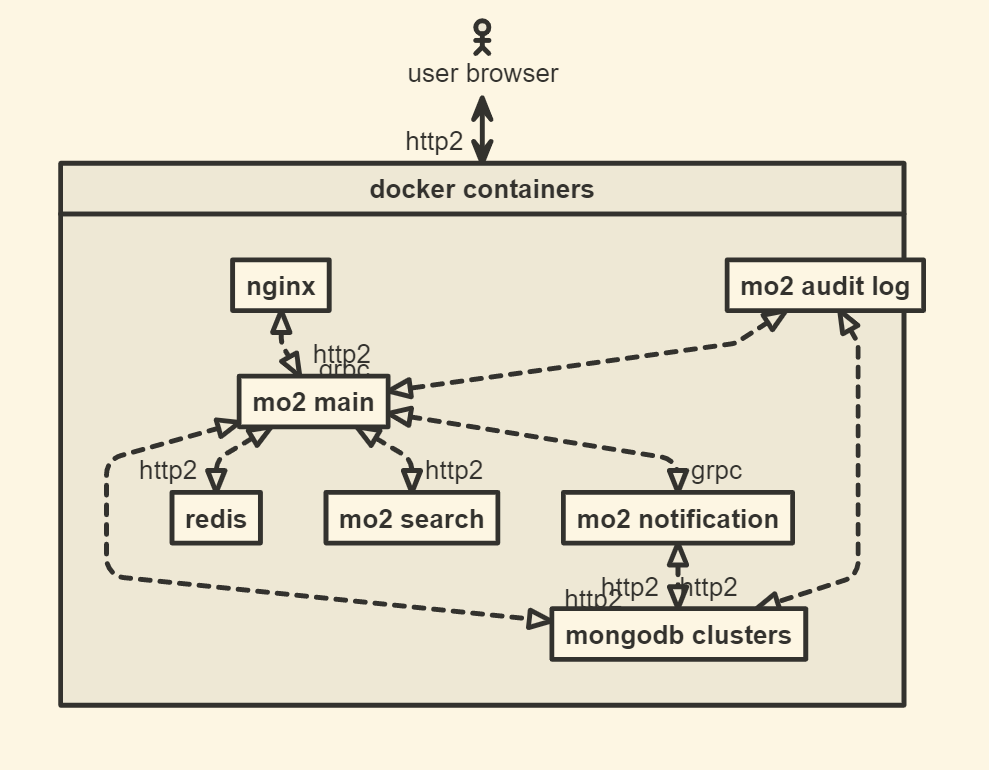

# Mo2
[](https://codecov.io/gh/Monkey-Mouse/mo2)


[](https://github.com/Monkey-Mouse/mo2)
[](https://goreportcard.com/report/github.com/Monkey-Mouse/mo2)
[](https://bettercodehub.com/)
[](/LICENSE)  
一个属于所有人的博客网站 [www.motwo.cn](https://www.motwo.cn)  


- [Mo2](#mo2)
  - [Why](#why)
  - [项目结构](#项目结构)
  - [运行项目](#运行项目)
    - [使用docker](#使用docker)
  - [从源码编译](#从源码编译)
    - [先决条件](#先决条件)
    - [编译服务器](#编译服务器)
      - [0.设置环境变量](#0设置环境变量)
      - [1.准备数据库服务](#1准备数据库服务)
      - [2.准备其它微服务](#2准备其它微服务)
      - [运行主服务](#运行主服务)
    - [编译前端](#编译前端)

## Why
在现在的网络上，有众多的公开博客网站，大家可以在上边发表自己的文章。  

但是这些网站都更新的很慢，风格千篇一律，很多用户想要的功能无法及时添加，用户无法获取自己真正最想要的体验。  

同时，大部分博客网站用户是希望能建造自己的个人博客的，或者说用户希望使用一个自己建造的博客。然而大部分人没有精力这么做，即使有word press这样的框架帮助，能自建博客的人任然很少，何况word press建造的基础网站本身也存在很多问题。  

所以我们的项目就是为了解决这个问题而诞生：我们意图打造一个开源的博客系统，使用持续集成和持续部署技术，吸引有想自己设计自己的博客的用户为我们的仓库提交代码。在用户的代码被接受并合并到生产分支后，我们的持续部署技术会在10分钟以内更新我们的服务器，让用户看到自己的更改，同时我们会记录下贡献者的信息，对他们进行鸣谢。让所有参与网站开发的人都有成就感。  

所以其实这个项目只有一小半是博客，一大半是社区。我们的目标是靠这个项目的特性吸引高质量用户，形成社区，将MO2建设为  
> A blog site made for everyone, and made by everyone  

## 项目结构
如你所见，最外层是一个go项目，我们的前端项目在[mo2front](/mo2front/)目录下。我们的计划是让每个重要的文件夹下
都有个readme文件。  
## 运行项目
运行项目有两种方法，第一种是使用docker，第二种是从源码进行编译。  

### 使用docker
参见[mo2-compose项目](https://github.com/Monkey-Mouse/mo2-compose)  

## 从源码编译
### 先决条件
- go 1.16
- 尽可能新的 npm 包管理工具
- 尽可能新的 mongodb
- 5.x-6.x的redis

### 编译服务器
Mo2是微服务架构。它的架构图如下：  
  
因此，如果想从源码运行Mo2需要先准备好所有依赖的微服务  
#### 0.设置环境变量
想要正确运行Mo2徐娅提前配置一些环境变量。如果缺少环境变量可能导致后端部分功能不可用或者无法启动。  
- MO2_MONGO_URL，mongodb地址，配置见1.
- REDIS_UR，redis地址，配置见1.
- qiniuak=xxx设置七牛的access key，缺少将无法使用图片上传相关功能
- qiniusk=xxx设置七牛的secret key，缺少将无法使用图片上传相关功能
- emailAddr=xxx Email地址
- emailPass=xxx Email smtp密码
- MO2_SEARCH_HOST=xxx Mo2搜索服务地址，缺少将无法使用搜索功能
- COMMENT_LOG=mo2notificationlog:9990 评论相关log功能的地址，缺少将导致评论相关功能不可用
- MO2_DATABASE=xxx 指定Mo2使用的数据库名称
- LOG_COL=notificationLog 指定log服务的Collection
- LOG_PORT=9990 指定log服务的端口
#### 1.准备数据库服务
首先，我们需要确保你的mongodb已经在运行。  
然后，我们需要把你的mongodb地址导出到环境变量中，
如果您的mongodb是默认配置的话，你可以使用以下命令：  
linux bash:  
```bash
export MO2_MONGO_URL=mongodb://127.0.0.1:27017
```
windows powershell:
```powershell
$env:MO2_MONGO_URL=mongodb://127.0.0.1:27017
```
之后，我们需要用同样的步骤配置redis  
首先确保redis的运行状态  
然后如果您的redis是默认配置的话，您可以使用以下命令：  
linux bash:  
```bash
export REDIS_URL=localhost:6379
```
windows powershell:
```powershell
$env:REDIS_URL=localhost:6379
```
#### 2.准备其它微服务
2.1 Mo2 Search  
Mo2的搜索服务。首先，拉取仓库  
```bash
git clone git@github.com:Monkey-Mouse/mo2search.git
```
然后，编译它，运行。  
2.2 Mo2 Log
Mo2的log服务。首先，拉取仓库  
```bash
git clone git@github.com:Monkey-Mouse/mo2log.git
```
然后，编译它，运行。 
#### 运行主服务
然后，使用同一个终端，在项目根目录：
```bash
go run main.go
```
即可运行后端
> **注意** 这样运行后端有部分功能不能使用。包括：
> - image upload相关功能
> - email发送相关功能
> 
> 使用这些功能需要预先设定特殊的环境变量

### 编译前端
在项目根目录打开一个终端，然后切换到[mo2front](/mo2front/)目录  
```bash
cd ./mo2front/
```
然后，使用npm进行install：
```bash
npm install
```
最后，运行前端
```bash
npm run serve
```
根据命令行提示打开对应的网页就可以看到前端页面
> **注意** Mo2在默认配置下，前端的运作并不要求本地运行后端，我们的设置会让npm在本地进行代理，将请求代理到我们的生产环境的服务器上。如果你想更改这项设置，请更改[vue.config.js](mo2front/vue.config.js)


