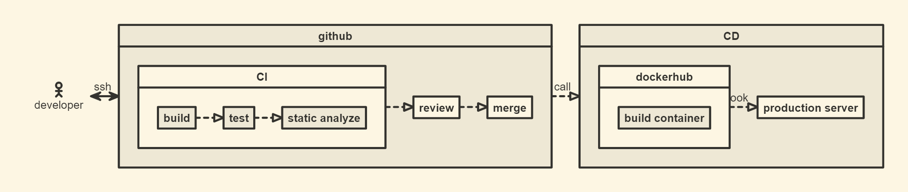

# SDLC

```nomnoml
#direction:right
[<actor>developers] <-> ssh[github|
    [CI|
        [build]--:>[test]
        [test]--:>[static analyze]
    ]
    [CI]--:>[review]
    [review]--:>[merge]
]
[github]--:>api call[CD|
    [dockerhub|
        [build container]
    ]
    [dockerhub]--:>apihook[production server]
]
```


