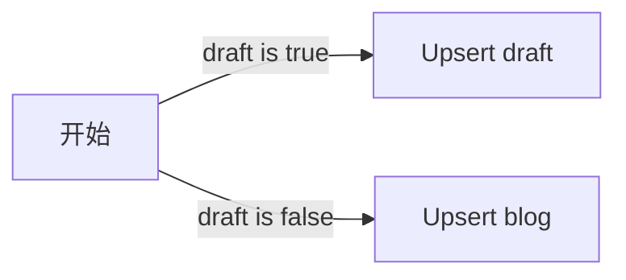

# DB v1

## User

```go

type Account struct {
	ID          primitive.ObjectID `json:"id" example:"xxxxxxxxxxxxx==" bson:"_id,omitempty"`
	UserName    string             `json:"userName" example:"account name"`
	Email       string             `json:"email" example:"email@qq.com"`
	HashedPwd   string             `json:"hashedPassword" example:"$2a$10$rXMPcOyfgdU6y5n3pkYQAukc3avJE9CLsx1v0Kn99GKV1NpREvN2i"`
    Avatar      string             `json:"avatar,omitempty" example:"https://xxx/xxx" bson:"avatar,omitempty"`
	EntityInfo  Entity             `json:"entityInfo,omitempty" bson:"entity_info,omitempty"`
    Description string             `json:"description,omitempty" example:"mouse ❤ monkey" bson:"description,omitempty"`
    KeyWords    []string           `json:"keyWords,omitempty" example:"xxx,xxx" bson:"key_words,omitempty"`
    Roles       []string           `json:"roles,omitempty" example:"xxx,xxx" bson:"roles,omitempty"`
}
```

## Blog
Blog和draft使用同一种model  
draft仅仅当作blog的备份，不具备其它功能。**它只给用户使用，不与其它后端的功能相关**  
  
```go
type Blog struct {
	ID          primitive.ObjectID `json:"id,omitempty" example:"xxxxxxxxxxxxx==" bson:"_id,omitempty"`
	AuthorID    primitive.ObjectID `json:"authorId,omitempty" example:"xxxxxxxxxxxxx==" bson:"author_id"`
	Title       string             `json:"title,omitempty" example:"mouse ❤ monkey" bson:"title,omitempty"`
	Description string             `json:"description,omitempty" example:"mouse ❤ monkey" bson:"description,omitempty"`
	Content     string             `json:"content,omitempty" example:"xxxx\nxxxx" bson:"content,omitempty"`
	EntityInfo  Entity             `json:"entityInfo,omitempty" bson:"entity_info,omitempty"`
	Cover       string             `json:"cover,omitempty" example:"https://xxx/xxx" bson:"cover,omitempty"`
	KeyWords    []string           `json:"keyWords,omitempty" example:"xxx,xxx" bson:"key_words,omitempty"`
}
```
### upsertBlog api
参数：  
- `draft` type: bool paramType: queryString
- `blog` type: Blog paramType: body



